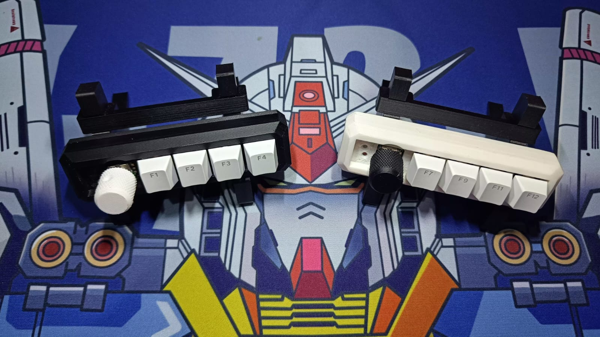
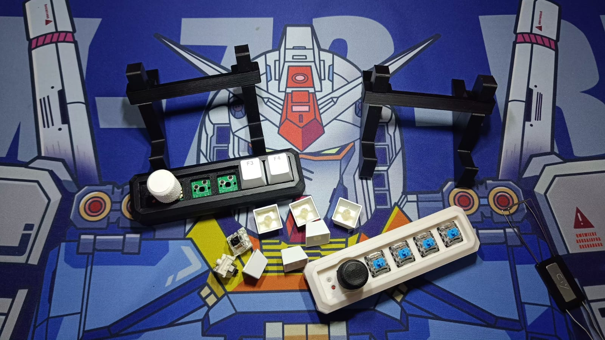
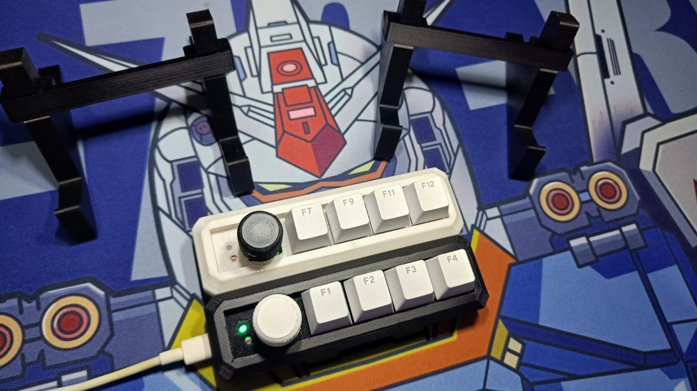
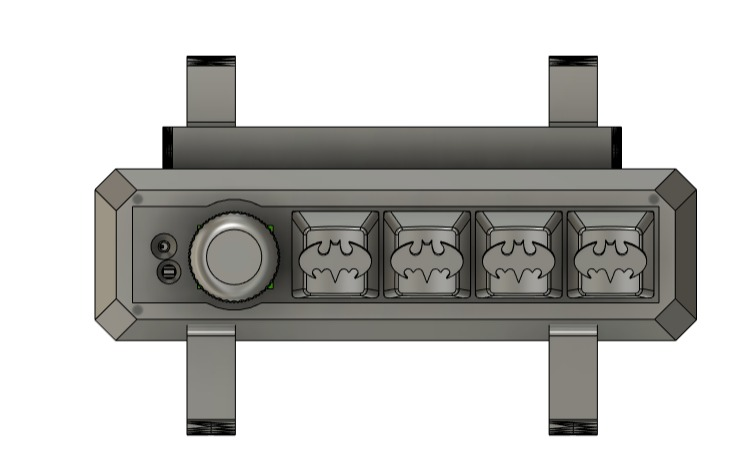
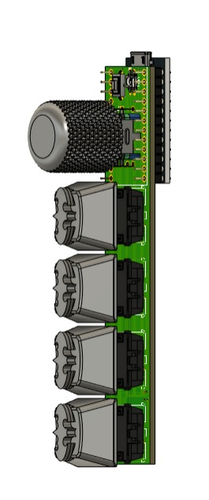
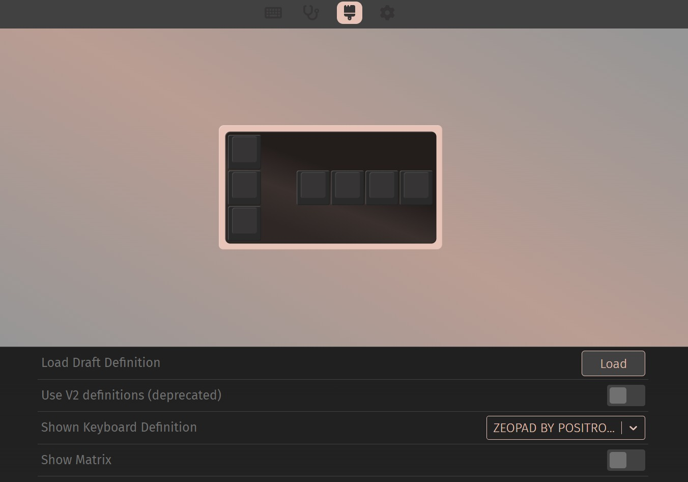

# ZEOPAD-QMK-VIA

## Spesification
- ATMEGA32U4 as Microcontroller
- QMK Firmware
- Support VIA, all key and knob can proggrammed
- RGB on top as indicator layer
- Reset Button on Top
- 4x Layer 
- 4x Switch
- Hotswap Switch
- 1x Encoder Knob
- 3D Case 

## Preview Hardware

  
  
  
  
  
  

## Preview VIA

  
 

https://github.com/juarendra/ZEOPAD-QMK-VIA/assets/43043633/6efb1be4-a013-4cfd-a778-e159bf880cd9

 

